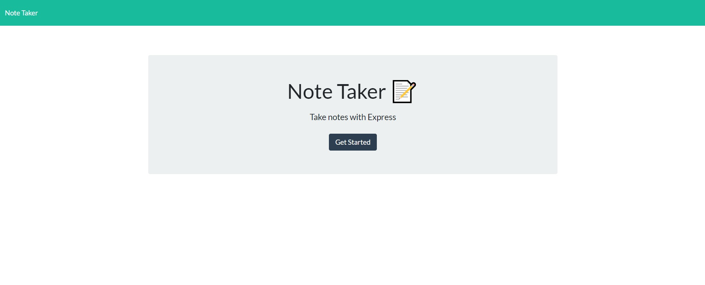
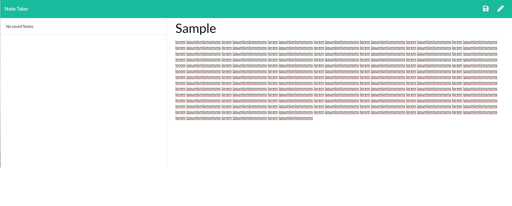
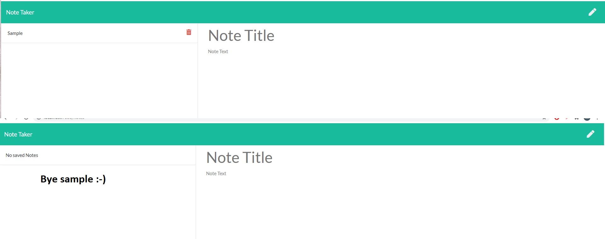
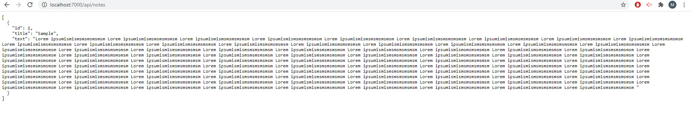

# Note-Taker-HW09 
link to deployed app 

## Description
Note Taker is an application that utilizes Express backend to store, delete and retrieve data.
Samples are shown as below

## Homework Images

## Business Context

For users that need to keep track of a lot of information, it's easy to forget or be unable to recall something important. Being able to take persistent notes allows users to have written information available when needed.